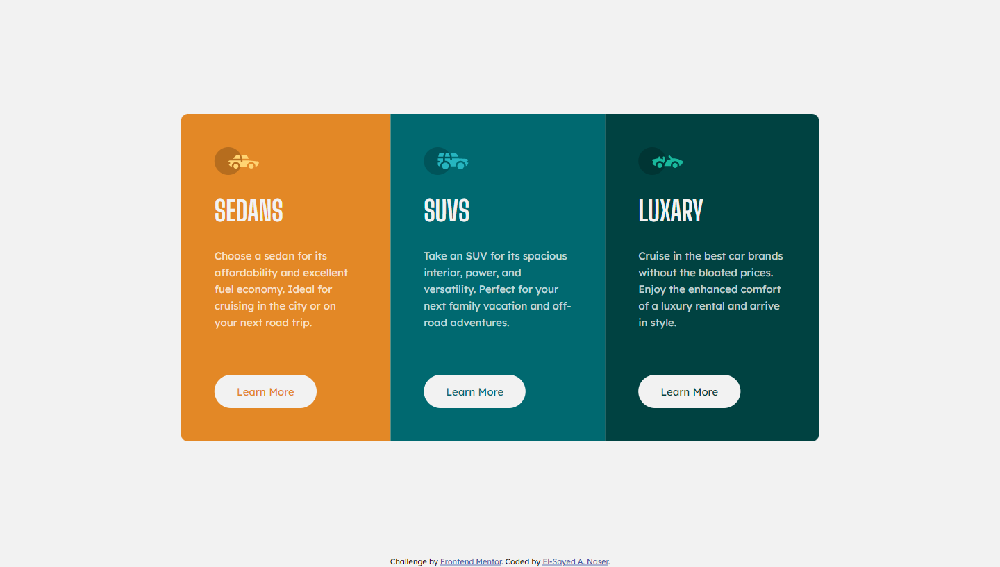

# Frontend Mentor - 3-column preview card component solution

This is a solution to the [3-column preview card component challenge on Frontend Mentor](https://www.frontendmentor.io/challenges/3column-preview-card-component-pH92eAR2-). Frontend Mentor challenges help you improve your coding skills by building realistic projects.

## Table of contents

- [Overview](#overview)
  - [The challenge](#the-challenge)
  - [Screenshot](#screenshot)
  - [Links](#links)
- [My process](#my-process)
  - [Built with](#built-with)
  - [What I learned](#what-i-learned)
  - [Continued development](#continued-development)
- [Author](#author)

## Overview

### The challenge

Users should be able to:

- View the optimal layout depending on their device's screen size
- See hover states for interactive elements

### Screenshot



### Links

- [Solution URL](https://github.com/sayednaser/3-column-preview-card-component-frontendmentor)
- [Live Site URL](https://sayednaser.github.io/3-column-preview-card-component-frontendmentor)

## My process

### Built with

- Semantic HTML5 markup
- CSS
- Flexbox
- Mobile-first workflow

### What I learned

It's the first challenge I approach it with Mobile-first Workflow. The mobile-version layout is flow, with no changes in the component. So, Mobile-first approach was ideal to use here.

The first note is that we favor percentages over paddings in measurements where we want it to look better for screens other than the two screen sizes (375px, 1440px).

We did that for horizontal spaces around the component in mobile-version.

```css
.card-container {
  padding: 8rem 6.4%;
}
```

For desktop-version, we want the component to get larger for screens bigger than 1440px, and stay at the initial size (918px) for smaller screens (>=1024).

```css
@media only screen and (min-width: 1024px) {
  .card {
    width: max(63.75%, 91.8rem);
  }
```

---

And for 4k screens, we increase the root font-size so that the whole components get bigger.

```css
@media only screen and (min-width: 2560px) {
  html {
    font-size: 120%;
  }
```

---

Regarding the button, line-height can get the button to the desired height, accurately with text centered.

**Note: When adding border for the hover effect, we decrease line-height so that the total height is the same.**

```css
.btn {
  text-decoration: none;
  display: block;

  background-color: hsl(0, 0%, 95%);
  width: fit-content;
  padding: 0 3.2rem;
  line-height: 4.8rem;
  border-radius: 100px;
}
```

```css
.btn:hover {
  border: 0.2rem solid hsl(0, 0%, 95%);
  line-height: 4.4rem;
  background-color: initial;
  color: hsl(0, 0%, 95%);
}
```

## Author

- Github - [@sayednaser](https://github.com/sayednaser)
- Frontend Mentor - [@sayednaser](https://www.frontendmentor.io/profile/sayednaser)
